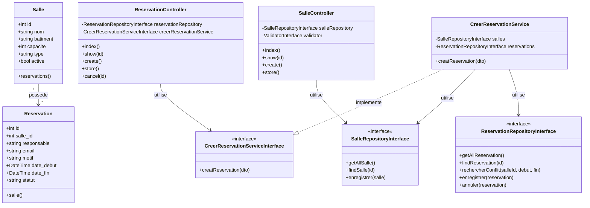

# Diagramme de classes

```mermaid
classDiagram
    class Salle {
        +int id
        +string nom
        +string batiment
        +int capacite
        +string type
        +bool active
        +reservations()
    }

    class Reservation {
        +int id
        +int salle_id
        +string responsable
        +string email
        +string motif
        +DateTime date_debut
        +DateTime date_fin
        +string statut
        +salle()
    }

    class SalleRepositoryInterface {
        <<interface>>
        +getAllSalle()
        +findSalle(id)
        +enregistrer(salle)
    }

    class ReservationRepositoryInterface {
        <<interface>>
        +getAllReservation()
        +findReservation(id)
        +rechercherConflit(salleId, debut, fin)
        +enregistrer(reservation)
        +annuler(reservation)
    }

    class CreerReservationServiceInterface {
        <<interface>>
        +creatReservation(dto)
    }

    class CreerReservationService {
        -SalleRepositoryInterface salles
        -ReservationRepositoryInterface reservations
        +creatReservation(dto)
    }

    class SalleController {
        -SalleRepositoryInterface salleRepository
        -ValidatorInterface validator
        +index()
        +show(id)
        +create()
        +store()
    }

    class ReservationController {
        -ReservationRepositoryInterface reservationRepository
        -CreerReservationServiceInterface creerReservationService
        +index()
        +show(id)
        +create()
        +store()
        +cancel(id)
    }

    Salle "1" --> "*" Reservation : possede
    CreerReservationService ..|> CreerReservationServiceInterface : implemente
    SalleController --> SalleRepositoryInterface : utilise
    ReservationController --> CreerReservationServiceInterface : utilise
    CreerReservationService --> SalleRepositoryInterface : utilise
    CreerReservationService --> ReservationRepositoryInterface : utilise
```